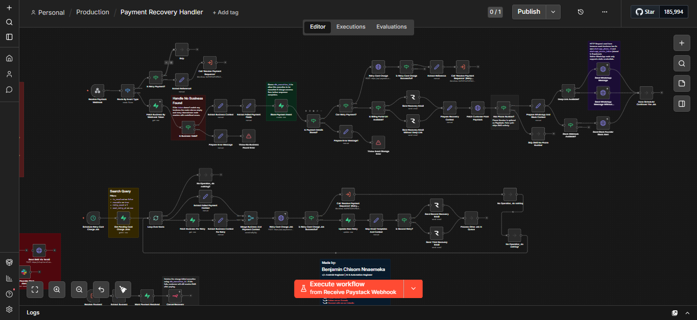
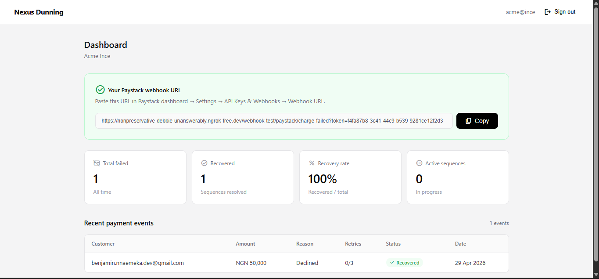

# Nexus Dunning

Nexus Dunning is a payment recovery automation tool for SaaS businesses. When a customer's payment fails, Nexus automatically sends a recovery sequence via email, WhatsApp, and Slack on behalf of the business — without any manual intervention.

Built to demonstrate multi-channel automation, webhook architecture, and SaaS tooling.

---

## Screenshots



## What it does

When a `charge.failed` webhook fires from Paystack:

1. Nexus identifies the business via a unique webhook token
2. Stores the payment event in Supabase
3. Sends a recovery email to the customer via Resend
4. Sends a WhatsApp message to the customer via Meta Cloud API
5. Sends a Slack alert to the business founder

If the customer pays, a `charge.success` webhook fires and Nexus marks the event resolved and cancels any waiting retry sequences.

A retry scheduler runs every hour — it picks up unresolved events, attempts to charge 
the card again, and sends progressively different email copy on each attempt, up to 3 times.

---

## Tech stack

| Layer | Tool |
|---|---|
| Workflow engine | n8n (self-hosted, Docker) |
| Database + Auth | Supabase (Postgres) |
| Email | Resend |
| WhatsApp | Meta WhatsApp Cloud API |
| Alerts | Slack incoming webhooks |
| Payments | Paystack |
| Frontend | Plain HTML, CSS, JS |
| Tunnel (dev) | ngrok |

---

## Architecture

### Webhook routing
Each business's Paystack webhook URL uses their `business.id` as the token:

```
{base_url}/webhook/paystack/charge-failed?token={business_id}
```

Incoming webhooks are routed by token — Nexus queries the `businesses` table by `id`, extracts credentials and context, then routes by event type.

### Workflows
- `Payment Recovery Handler` — main workflow, handles `charge.failed` and `charge.success`
- `Resolve Payment Sequence` — sub-workflow, cancels waiting executions when payment recovers
- `Schedule Retry Card Charge Job` — cron job, runs hourly, retries unresolved events up to 3 times
- `Global Error Handler` — error logging, triggers mannually and automatically when error occurs in the workflow (not included in the workflows file, create one)

### Email templates
- Email 1 — sent immediately on failure, includes billing portal link if configured
- Email 2 — sent on first retry (24h later)
- Email 3 — sent on second retry (48h later)
- No billing portal fallback — if `billing_portal_url` is not set, a softer email is sent with no CTA button

### WhatsApp
The n8n native WhatsApp node uses static credentials and cannot support per-business dynamic credentials. An HTTP Request node is used instead, with `whatsapp_phone_id` and `whatsapp_access_token` injected dynamically from the business record.

---

## Database schema

### `businesses`
| Column | Type | Notes |
|---|---|---|
| id | uuid | Primary key |
| user_id | uuid | Supabase auth user |
| business_name | text | |
| email | text | |
| paystack_secret_key | text | |
| webhook_token | uuid | Auto-generated, never editable |
| billing_portal_url | text | Used as CTA in recovery emails |
| whatsapp_phone_id | text | |
| whatsapp_access_token | text | |
| slack_webhook_url | text | |
| is_onboarded | boolean | |
| created_at | timestamptz | |
| updated_at | timestamptz | |

### `payment_events`
| Column | Type | Notes |
|---|---|---|
| id | uuid | Primary key |
| business_id | uuid | FK → businesses |
| customer_email | text | |
| customer_code | text | Paystack customer code |
| amount | integer | In kobo |
| currency | text | |
| reference | text | Paystack reference |
| failure_reason | text | |
| authorization_code | text | For card retry |
| channel | text | card, bank, etc. |
| reusable | boolean | Whether card can be retried |
| retry_count | integer | Max 3 |
| next_retry_at | timestamptz | |
| is_resolved | boolean | |
| resolved_at | timestamptz | |
| n8n_execution_id | text | For cancelling waiting executions |
| payment_link | text | |
| event_time | timestamptz | |
| created_at | timestamptz | |
| updated_at | timestamptz | |

---

## Web frontend

```
nexus-web/
  index.html            — entry point
  css/
    style.css           — shared styles
  js/
    config.js           — Supabase credentials (gitignored)
    config.example.js   — template for config.js
    supabase.js         — Supabase client init
    auth.js             — shared checkAuth and signOut helpers
  workflows/
    Payment_Recovery_Handler.json
  pages/
    signup.html
    login.html
    onboarding.html     — collects Paystack keys, billing URL, WhatsApp, Slack
    dashboard.html      — per-business payment events and recovery stats
```

### Setup
1. Copy `js/config.example.js` to `js/config.js`
2. Fill in your Supabase URL and anon key
3. Open `index.html` in a browser or serve with any static file server

---

## Local setup

### Prerequisites
- Docker (for n8n)
- Supabase project
- Paystack account
- Meta developer app with WhatsApp Cloud API enabled
- Resend account
- ngrok (for local webhook testing)

### n8n
```bash
docker compose up -d
```

Import `workflows/Payment_Recovery_Handler.json` into your n8n instance.

See [WORKFLOW.md](./WORKFLOW.md) for full node-by-node documentation of the workflow.

### Environment
Create `js/config.js` from the example file and fill in your credentials. This file is gitignored and never committed.

---

## Key decisions

**No payment link generation** — instead of generating Paystack payment links dynamically, businesses provide a `billing_portal_url` during onboarding. This is used as the CTA in all recovery emails, simplifying the architecture significantly.

**Business ID as webhook token** — each business's `id` (UUID) is used as the webhook token. This allows a single n8n webhook endpoint to serve multiple businesses without any additional token generation or storage.

**HTTP Request over native WhatsApp node** — n8n's built-in WhatsApp node uses static credentials set at design time. Since each business has their own Meta credentials, the HTTP Request node is used with credentials injected dynamically from Supabase.

**Row Level Security** — RLS is enabled on both `businesses` and `payment_events`. The frontend also filters by `business_id` manually as a secondary safeguard.

---

## Status

Complete. Not in production.

Follow me to see what I build next.

---

## License

[](LICENSE)