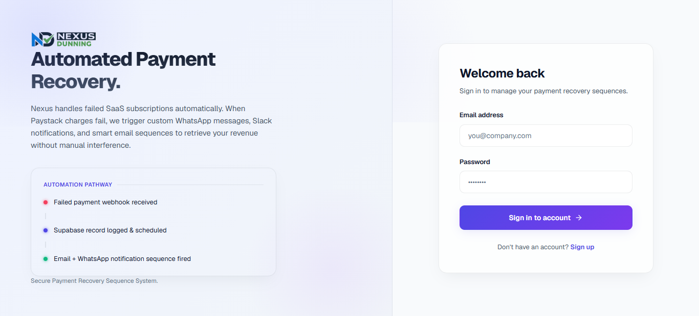
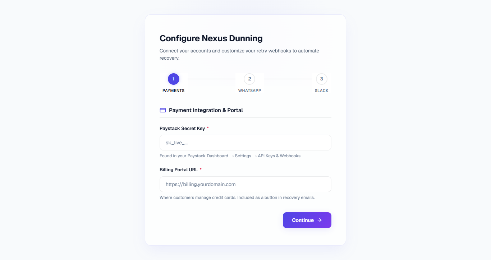
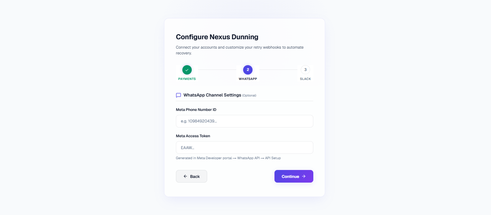
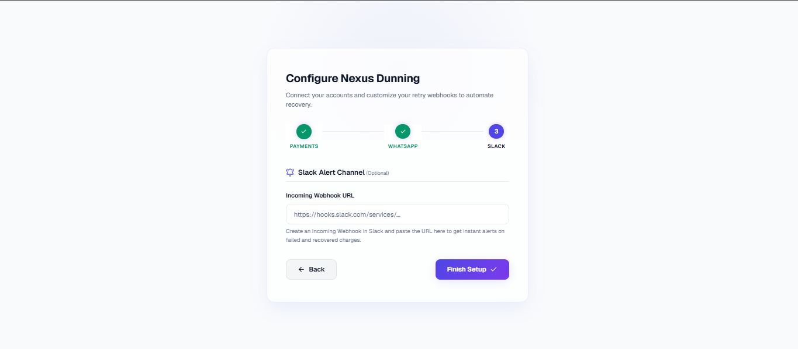
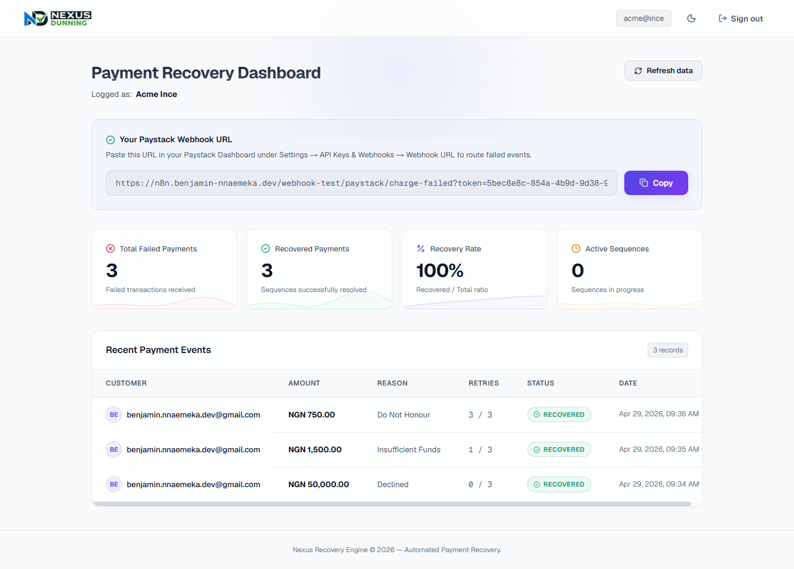
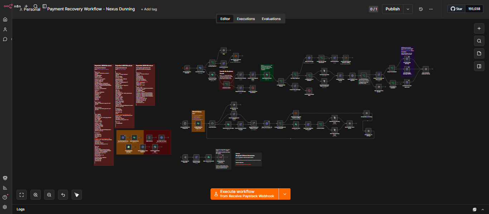
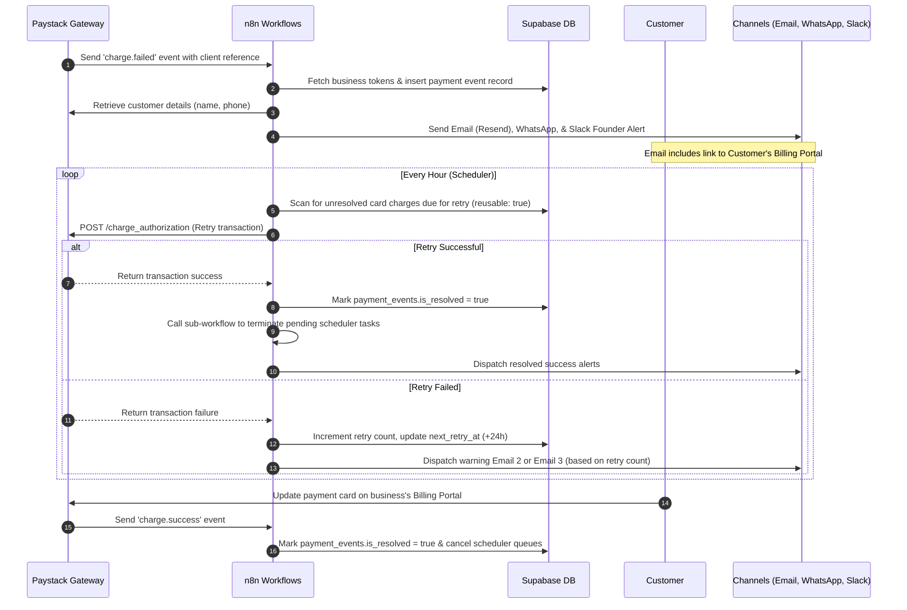

<p align="center">
  
  <br>
  <br>
  Payment Recovery Workflow Automation
</p>

---

Nexus Dunning is a self-hosted Payment Recovery (Dunning) system designed for SaaS and subscription businesses using Paystack. By combining an interactive Next.js 16 dashboard with automated n8n workflows, Nexus Dunning intercepts failed subscription charges, executes progressive card charge retries, and coordinates customer-facing recovery campaigns across Email (Resend), WhatsApp (Facebook Graph API), and Slack. [See Workflow Documentation](WORKFLOW.md)

---

## Screenshots

| Login | Onboarding (Step 1) | Onboarding (Step 2) |
|:---:|:---:|:---:|
|  |  |  |

| Onboarding (Step 3) | Dashboard | n8n Workflow |
|:---:|:---:|:---:|
|  |  |  |

---

## System Architecture & Flow

The system is split into two halves:
1. **Frontend App:** A Next.js dashboard built with React 19 and Supabase auth where businesses sign up, onboard, configure keys, and monitor live payment statuses.
2. **Backend Daemon (n8n):** An automated workflow pipeline handling webhook parsing, API coordination, communication schedules, and database logs.

### Recovery & Retry Lifecycle


```mermaid
sequenceDiagram
    autonumber
    participant Paystack as Paystack Gateway
    participant n8n as n8n Workflows
    participant DB as Supabase DB
    participant User as Customer
    participant Channels as Channels (Email, WhatsApp, Slack)

    %% Charge Failed Webhook
    Paystack->>n8n: Send 'charge.failed' event with client reference
    n8n->>DB: Fetch business tokens & insert payment event record
    n8n->>Paystack: Retrieve customer details (name, phone)
    n8n->>Channels: Send Email (Resend), WhatsApp, & Slack Founder Alert
    Note over Channels,User: Email includes link to Customer's Billing Portal

    %% Hourly Retry Loop
    loop Every Hour (Scheduler)
        n8n->>DB: Scan for unresolved card charges due for retry (reusable: true)
        n8n->>Paystack: POST /charge_authorization (Retry transaction)
        alt Retry Successful
            Paystack-->>n8n: Return transaction success
            n8n->>DB: Mark payment_events.is_resolved = true
            n8n->>n8n: Call sub-workflow to terminate pending scheduler tasks
            n8n->>Channels: Dispatch resolved success alerts
        else Retry Failed
            Paystack-->>n8n: Return transaction failure
            n8n->>DB: Increment retry count, update next_retry_at (+24h)
            n8n->>Channels: Dispatch warning Email 2 or Email 3 (based on retry count)
        end
    end

    %% Customer Manual Resolution
    User->>Paystack: Update payment card on business's Billing Portal
    Paystack->>n8n: Send 'charge.success' event
    n8n->>DB: Mark payment_events.is_resolved = true & cancel scheduler queues
```

---

## Core Features

- **High-Fidelity Analytics & Monitoring:**
  - Real-time statistics: Total Failed Payments, Recovered Payments, Recovery Rate (%), and Active Dunning Sequences.
  - Interactive activity log rendering exact failure reasons, retry counts, resolution states, and timestamps.
  - Responsive layout with skeleton loaders, glowing sparklines, and theme toggling (Obsidian Dark Theme vs. Slate Light Theme).
- **Self-Serve Business Onboarding:**
  - Secure login and registration with Supabase Auth.
  - Walkthrough wizard collecting Paystack API keys, custom Billing Portals, WhatsApp API tokens, and Slack webhook endpoints.
- **Dynamic Multi-Channel Notifications:**
  - **Emails via Resend:** Rich email notifications configured with active call-to-actions (pointing users directly to the billing portal so they can update cards).
  - **WhatsApp via Facebook Graph API:** Generates dynamic HTTP requests injecting credentials per business profile, circumventing n8n's static credentials limitations.
  - **Slack founder alerts:** Instant Slack notifications to notify business administrators of payment activity.
- **Intelligent Card Charge Scheduler:**
  - Automatically identifies reusable authorizations to attempt direct background card retries.
  - Progressive retry engine executing up to 3 retry transactions spaced 24 hours apart.
  - Instant cancel mechanics immediately terminating notification schedules once a payment succeeds.

---

## Tech Stack & Dependencies

- **Frontend Core:** [Next.js 16](file:///C:/Users/HP/Desktop/nexus-dunning/package.json#L14) (App Router), [React 19](file:///C:/Users/HP/Desktop/nexus-dunning/package.json#L15), [TypeScript](file:///C:/Users/HP/Desktop/nexus-dunning/package.json#L24)
- **Styling:** Vanilla CSS with custom theme design system (see [globals.css](file:///C:/Users/HP/Desktop/nexus-dunning/src/app/globals.css))
- **Database & Auth:** [Supabase JS Client](file:///C:/Users/HP/Desktop/nexus-dunning/package.json#L12) (PostgreSQL instance)
- **Icons:** [Lucide React](file:///C:/Users/HP/Desktop/nexus-dunning/package.json#L13)
- **Automation Engine:** n8n (hosting the payment recovery workflow)

---

## Database Schema Setup

To support this project, create the following two tables in your Supabase database instance. You can copy-paste the SQL queries below directly into the **Supabase SQL Editor**:

```sql
-- 1. Businesses Table (Configuration Profiles)
CREATE TABLE public.businesses (
    id UUID PRIMARY KEY DEFAULT gen_random_uuid(),
    user_id UUID NOT NULL UNIQUE REFERENCES auth.users(id) ON DELETE CASCADE,
    business_name TEXT NOT NULL,
    email TEXT NOT NULL,
    is_onboarded BOOLEAN DEFAULT false,
    paystack_secret_key TEXT,
    billing_portal_url TEXT,
    whatsapp_phone_id TEXT,
    whatsapp_access_token TEXT,
    slack_webhook_url TEXT,
    created_at TIMESTAMP WITH TIME ZONE DEFAULT timezone('utc'::text, now()) NOT NULL,
    updated_at TIMESTAMP WITH TIME ZONE
);

-- Enable RLS (Row Level Security)
ALTER TABLE public.businesses ENABLE ROW LEVEL SECURITY;

-- Setup basic policies (Users can only see/edit their own business settings)
CREATE POLICY "Users can view their own business profile" ON public.businesses
    FOR SELECT TO authenticated USING (auth.uid() = user_id);

CREATE POLICY "Users can update their own business profile" ON public.businesses
    FOR UPDATE TO authenticated USING (auth.uid() = user_id);

CREATE POLICY "Users can insert their own business profile" ON public.businesses
    FOR INSERT TO authenticated WITH CHECK (auth.uid() = user_id);


-- 2. Payment Events Table (Dunning Tracking Log)
CREATE TABLE public.payment_events (
    id UUID PRIMARY KEY DEFAULT gen_random_uuid(),
    business_id UUID NOT NULL REFERENCES public.businesses(id) ON DELETE CASCADE,
    customer_email TEXT NOT NULL,
    customer_code TEXT NOT NULL,
    amount BIGINT NOT NULL, -- Stored in smallest currency unit (kobo for NGN)
    display_amount TEXT NOT NULL,
    currency TEXT NOT NULL,
    reference TEXT NOT NULL UNIQUE,
    failure_reason TEXT,
    event_time TIMESTAMP WITH TIME ZONE,
    display_event_time TEXT,
    authorization_code TEXT,
    reusable BOOLEAN DEFAULT false,
    channel TEXT,
    retry_count INTEGER DEFAULT 0,
    next_retry_at TIMESTAMP WITH TIME ZONE,
    n8n_execution_id TEXT,
    is_resolved BOOLEAN DEFAULT false,
    resolved_at TIMESTAMP WITH TIME ZONE,
    created_at TIMESTAMP WITH TIME ZONE DEFAULT timezone('utc'::text, now()) NOT NULL
);

-- Enable RLS
ALTER TABLE public.payment_events ENABLE ROW LEVEL SECURITY;

-- Policies for Payment Events
CREATE POLICY "Users can view their business's payment logs" ON public.payment_events
    FOR SELECT TO authenticated USING (
        business_id IN (SELECT id FROM public.businesses WHERE user_id = auth.uid())
    );
```

---

## Project Installation & Configuration

### 1. Web Application (Dashboard Setup)

First, install local dependencies and specify connection credentials.

1. **Clone the repository:**
   ```bash
   git clone <your-repo-url>
   cd nexus-dunning
   ```

2. **Configure environment variables:**
   Create a `.env.local` file in the root directory (matching [example configurations](file:///C:/Users/HP/Desktop/nexus-dunning/.env.local)):
   ```env
   NEXT_PUBLIC_SUPABASE_URL=https://your-supabase-project.supabase.co
   NEXT_PUBLIC_SUPABASE_ANON_KEY=your-supabase-anon-public-key
   ```

3. **Install dependencies:**
   ```bash
   pnpm install
   ```

4. **Launch development server:**
   ```bash
   pnpm dev
   ```
   Open [http://localhost:3000](http://localhost:3000) to view the client application.

### 2. Automation Daemon (n8n Setup)

The workflow schema is archived under [workflows/Payment Recovery Workflow - Nexus Dunning.json](file:///C:/Users/HP/Desktop/nexus-dunning/workflows/Payment%20Recovery%20Workflow%20-%20Nexus%20Dunning.json). 

Detailed documentation of each n8n node logic is available in [WORKFLOW.md](file:///C:/Users/HP/Desktop/nexus-dunning/WORKFLOW.md).

1. Spin up your n8n instance and create a new workflow.
2. Select **Import from File** from the n8n menu and choose `Payment Recovery Workflow - Nexus Dunning.json`.
3. Configure the following environment node integrations inside n8n:
   - **Supabase credentials** (used in `Fetch Business`, `Store Payment Event`, `Get Pending Card Charge Jobs`, `Update Next Retry`, `Mark Payment Resolved`).
   - **Resend integration** (configure Resend email node credentials for follow-ups).
   - **Slack Webhook URL** (dynamically resolved but verify node setup).

---

## Paystack Integration

To start capturing failed payments:

1. Deploy the Next.js frontend and n8n workflow.
2. Complete the onboarding wizard at `/onboarding` to configure your keys.
3. Access your **Payment Recovery Dashboard** at `/dashboard` and copy the auto-generated **Paystack Webhook URL** which looks like:
   `https://n8n.yourdomain.com/webhook/paystack/charge-failed?token=YOUR_BUSINESS_ID`
4. Log into your **Paystack Dashboard** and navigate to **Settings** -> **API Keys & Webhooks**.
5. Paste your copied URL into the **Webhook URL** input field.
6. Check or enable subscription/transaction events, specifically ensuring `charge.failed` and `charge.success` are captured and routed.

---

## Source Code Walkthrough

- [`/src/app/page.tsx`](file:///C:/Users/HP/Desktop/nexus-dunning/src/app/page.tsx) - Main entry gateway that verifies user auth tokens and redirects accordingly.
- [`/src/app/signup/page.tsx`](file:///C:/Users/HP/Desktop/nexus-dunning/src/app/signup/page.tsx) - Form validating registration credentials, registering accounts with Supabase Auth, and provisioning a blank `businesses` table profile.
- [`/src/app/onboarding/page.tsx`](file:///C:/Users/HP/Desktop/nexus-dunning/src/app/onboarding/page.tsx) - Multi-step wizard capturing API tokens (Paystack, WhatsApp, Slack, Resend, Billing Portal URLs) and updating onboarding parameters.
- [`/src/app/dashboard/page.tsx`](file:///C:/Users/HP/Desktop/nexus-dunning/src/app/dashboard/page.tsx) - Analytics grid calculating metric rates and listing detailed log entries.
- [`/src/lib/supabase.ts`](file:///C:/Users/HP/Desktop/nexus-dunning/src/lib/supabase.ts) - Setup file exporting the initialization of the Supabase Client.

---

## License & Attribution

This project is open-source and released under the [MIT License](file:///C:/Users/HP/Desktop/nexus-dunning/LICENSE).

Designed and engineered by **[Benjamin Chisom Nnaemeka](https://github.com/benjamin-nnaemeka-dev)**.
